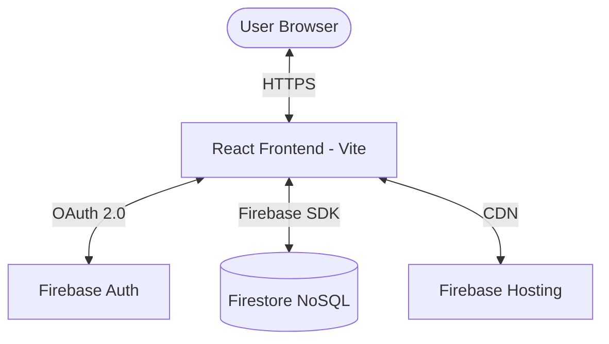
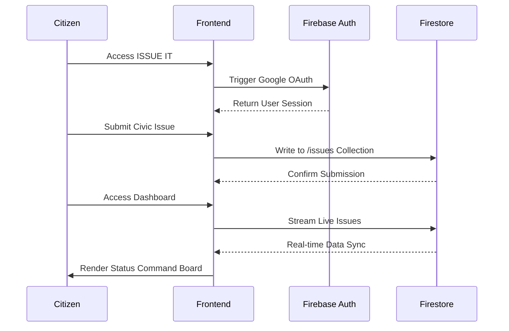

# ISSUE IT

An intelligent, hyper-performant local platform to log, track, and coordinate civic action. Designed with a high-contrast Neo-Brutalist aesthetic, it cuts through the bureaucratic noise to deliver results.

## System Architecture



## Application Flow



## Features

### Frictionless Access
- Instant Google OAuth sign-in flow for secure and rapid authentication.
- Seamless user profiling and session management without passwords.

### Precision Tracking
- Hyper-local tracking systems to pinpoint and monitor community disruptions.
- Centralized data aggregation for neighborhood-level issue awareness.

### Interactive Reporting
- High-contrast, rapid-fire issue submission interfaces built for speed.
- Uncompromising Neo-Brutalist design aesthetic that prioritizes function over fluff.

### Command Boards
- Clean, kanban-style status tracking and management boards.
- Real-time updates for issue resolution statuses (Pending, In Progress, Resolved).

## Technology Stack

### Frontend


### Backend & Infrastructure


## Setup Instructions

**1. Clone the repository**
```bash
git clone https://github.com/yourusername/issue-it.git
cd issue-it
```

**2. Install dependencies**
```bash
npm install
```

**3. Configure Environment**
Create a `.env` file in the root directory:
```env
VITE_FIREBASE_API_KEY=your_api_key
VITE_FIREBASE_AUTH_DOMAIN=your_project.firebaseapp.com
VITE_FIREBASE_PROJECT_ID=your_project_id
VITE_FIREBASE_STORAGE_BUCKET=your_project.appspot.com
VITE_FIREBASE_MESSAGING_SENDER_ID=your_sender_id
VITE_FIREBASE_APP_ID=your_app_id
```

**4. Start development server**
```bash
npm run dev
```
