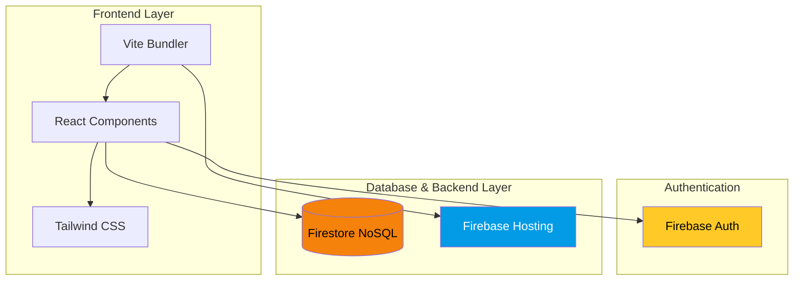
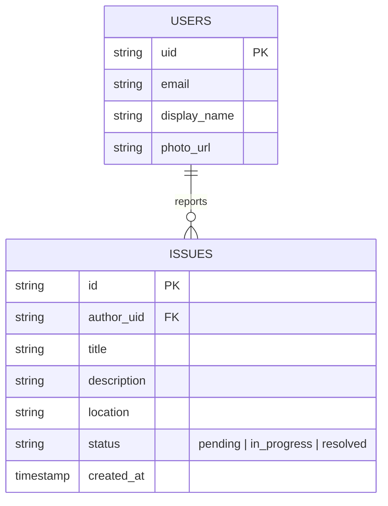

# 🚧 ISSUE IT

> An intelligent, high-contrast hyperlocal platform to log, track, and coordinate civic action. No fluff. Just results.

[](https://react.dev/)
[](https://vitejs.dev/)
[](https://tailwindcss.com/)
[](https://firebase.google.com/)

## 📖 Overview

ISSUE IT cuts through the bureaucratic noise. Designed with a stark, unapologetic Neo-Brutalist aesthetic, this platform delivers a hyper-performant interface for communities to report and resolve local issues. It is fast, highly responsive, and engineered on a modern serverless stack.

### 🎯 Core Features

- **🔐 Frictionless Access** - Instant Google OAuth sign-in flow.
- **📍 Precision Tracking** - Hyper-local tracking systems to monitor community disruptions.
- **⚡ Interactive Reporting** - High-contrast, rapid-fire issue submission interfaces.
- **📋 Command Boards** - Clean, uncompromising status tracking and management boards.

## 🏗️ Architecture



## 🗄️ Database Schema



## 🚀 Setup & Commands

Launch the platform locally in seconds.

### 1. Clone the repository
```bash
git clone https://github.com/yourusername/issue-it.git
cd issue-it
```

### 2. Install dependencies
```bash
npm install
```

### 3. Environment Configuration
Create a `.env` file in the root directory and add your Firebase credentials:
```env
VITE_FIREBASE_API_KEY=your_api_key
VITE_FIREBASE_AUTH_DOMAIN=your_project.firebaseapp.com
VITE_FIREBASE_PROJECT_ID=your_project_id
VITE_FIREBASE_STORAGE_BUCKET=your_project.appspot.com
VITE_FIREBASE_MESSAGING_SENDER_ID=your_sender_id
VITE_FIREBASE_APP_ID=your_app_id
```

### 4. Start the development server
```bash
npm run dev
```

### 5. Deploy to Production
```bash
npx firebase deploy
```
